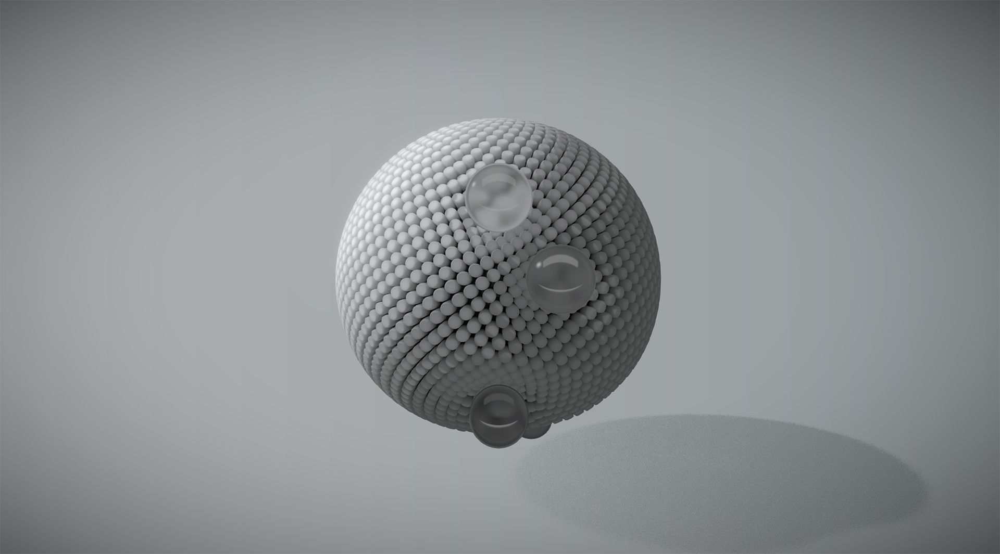

<!-- workspace-hub:cover:start -->

<!-- workspace-hub:cover:end -->

# threejs-orbital-glass

Small React Three Fiber prototype that renders a glass-like orbital form with custom shaders, postprocessing, and animated orbiting spheres.

## Preview

[Live preview](https://proto.lucidity.design/sites/threejs-orbital-glass)

## Stack

- React 19
- `@react-three/fiber`
- `@react-three/drei`
- Three.js
- `postprocessing`
- Create React App (`react-scripts`)
- `pnpm`

## Run locally

Install dependencies if needed:

```bash
pnpm install
```

Start the development server:

```bash
pnpm start
```

Or run it from any current shell directory with the repo wrapper:

```bash
/absolute/path/to/threejs-orbital-glass/run.command
```

Create a production build:

```bash
pnpm build
```

Or build from anywhere with:

```bash
/absolute/path/to/threejs-orbital-glass/build.command
```

The CRA dev server defaults to:

```text
http://127.0.0.1:3000
```

## Project structure

- `src/App.js` sets up the `Canvas`, camera, and scene wiring.
- `src/Hero.js` contains the main instanced glass form, orbiting spheres, lighting, and floor.
- `src/Background.js` renders the fullscreen shader background.
- `src/usePostprocessing.js` configures bloom, SMAA, and vignette passes.
- `public/` contains texture assets used by the shaders.

## Notes

- This repo is treated as a direct-runtime frontend prototype in the workspace.
- `pnpm build` currently succeeds with a transitive source map warning from a dependency in `node_modules`; the app code still compiles.
